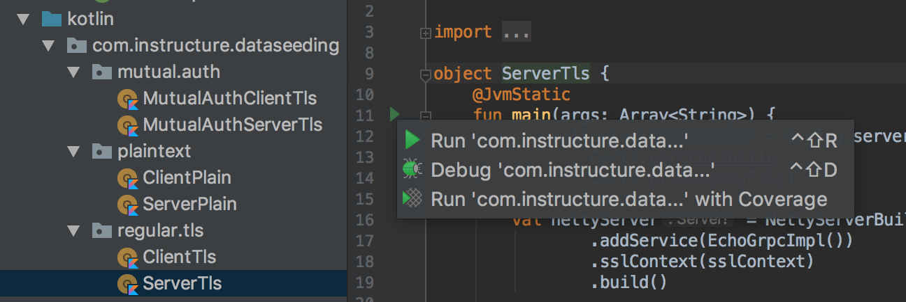
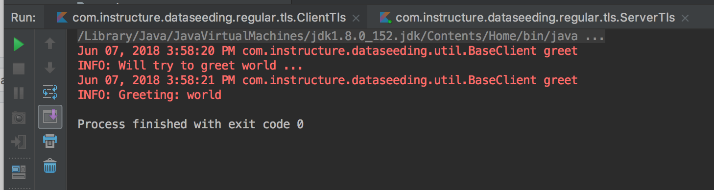

# gRPC Java Auth examples

echo.proto is from [grpc-swift](https://github.com/grpc/grpc-swift/blob/master/Sources/Examples/Echo/echo.proto)

generate certs using `./soseedygrpc/openssl/key.sh`

- Install [JetBrains Toolbox](https://www.jetbrains.com/toolbox/)
- Install `IntelliJ IDEA Community`
- Open `build.gradle`
- Run the server and clients from the IDE
  - `mutual_auth/MutualAuthServerTls.kt`
  - `mutual_auth/MutualAuthClientTls.kt`
  - `regular_tls/ServerTls.kt`
  - `regular_tls/ClientTls.kt`
  - `token_auth/TokenAuthServer.kt`
  - `token_auth/TokenAuthClient.kt`
  - `plaintext/ClientPlain.kt`
  - `plaintext/ServerPlain.kt`
- cd JavaAuthSwift; pod install
- open JavaAuth.xcworkspace
- run JavaAuthTests

## failed to bind

- `killall -9 java`

## connect refused

Update `/etc/hosts` with `127.0.0.1	example.com`
The cert generation script is tied to the example.com hostname.

## errors

> Caused by: javax.net.ssl.SSLHandshakeException: error:10000410:SSL routines:OPENSSL_internal:SSLV3_ALERT_HANDSHAKE_FAILURE

Java client hostname wrong. Fix by updating `CLIENT_CN="localhost"` to `CLIENT_CN="example.com"`

ca subject must be `"/CN=${SERVER_CN}"` and not ` "/C=US/ST=Foo/L=Bar/O=Baz/CN=Xyz"`

> SwiftGRPC.RPCError.callError(successful, status unavailable: Connect Failed

Swift client hostname wrong. Fix by updating `CLIENT_CN="example.com"` to `CLIENT_CN="localhost"`
